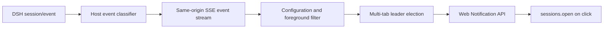

# dsh-notifications

[中文版](./README.md)

DeepSeek Harness (DSH) web notification plugin. It reminds users through browser notifications when a session is waiting for approval, asking a structured question, completed successfully, or failed. Clicking a notification opens the corresponding session.

## Features

- Watches all DSH sessions, not only the currently open session.
- Supports approval-pending, question-pending, task-succeeded, and task-failed notifications.
- Suppresses duplicate notifications while the current session is in the foreground.
- Elects one leader tab to send notifications when multiple DSH tabs are open.
- Focuses DSH and opens the corresponding session when a notification is clicked.
- Provides a dedicated configuration module under “Settings → Plugins → Plugin configuration”.
- Notification events contain no chat content, question content, approval parameters, or tool parameters.
- Provides Chinese and English UI strings.

## Contents

- [Compatibility](#compatibility)
- [Installation](#installation)
- [Usage](#usage)
- [Configuration UI](#configuration-ui)
- [Configuration](#configuration)
- [How it works](#how-it-works)
- [Development and testing](#development-and-testing)
- [Known limitations](#known-limitations)
- [Support](#support)
- [Contributing](#contributing)
- [License](#license)

## Compatibility

- DeepSeek Harness `0.1.0-rc.6` and `0.1.0-rc.7` series.
- Windows, macOS, and Linux.
- Desktop Chrome, Edge, Brave, Chromium, and other Chromium-based browsers.
- The DSH page must remain open; notifications cannot be delivered after the browser closes.
- The current DSH origin must be granted browser notification permission. Loopback addresses may use the Web Notification API; browsers may reject non-secure remote HTTP addresses.

## Installation

Prerequisite: DSH is installed, and the pnpm major version matches the store version used by the current profile.

```bash
dsh plugin --profile web add dsh-notifications@file:/absolute/path/to/dsh-notifications
```

`file:` installation uses a snapshot. Re-run the installation command after updating the source, then restart `dsh web`; do not use `link:` installation.

Uninstall:

```bash
dsh plugin --profile web remove dsh-notifications
```

## Usage

1. Install the plugin and restart `dsh web`.
2. Open “Settings → Plugins → Plugin configuration”.
3. Expand the “Notifications” module.
4. Click “Authorize notifications” and allow the browser permission request.
5. Click “Send test notification” to verify the browser settings.
6. Enable or disable the four notification types as needed, then save.

By default, notifications are sent only when the DSH tab is in the background or when an event belongs to a session other than the current one. Clicking a notification focuses DSH and opens the target session; if that session no longer exists, the page is only focused.

## Configuration UI

Collapsed plugin configuration list:


Expanded notifications configuration:


## Configuration

Configuration is stored in the DSH settings service under the `dsh-notifications` namespace:

| Field | Default | Description |
| --- | --- | --- |
| `enabled` | `true` | Master switch |
| `approvalPendingEnabled` | `true` | Approval-pending notifications |
| `questionPendingEnabled` | `true` | Structured-question notifications |
| `taskSucceededEnabled` | `true` | Task-success notifications |
| `taskFailedEnabled` | `true` | Task-failure notifications |

Browser permission is not stored in DSH configuration; the browser stores it independently for the DSH origin.

## How it works



The host subscribes to `session/event` from DSH and normalizes events into the following safe structure:

```json
{
  "eventId": "session-id:sequence:event-type",
  "type": "approval_pending",
  "sessionId": "session-id",
  "occurredAt": 1786953600000
}
```

Same-origin endpoints:

| Method | Path | Purpose |
| --- | --- | --- |
| `GET` | `/dsh-notifications/api/config` | Read configuration and revision |
| `POST` | `/dsh-notifications/api/config` | Save or restore default configuration |
| `GET` | `/dsh-notifications/api/events` | SSE notification event stream |

SSE events are replayed only after a short connection interruption: the host keeps at most 256 events for 5 minutes in memory. The first connection and a host restart do not replay historical events.

## Development and testing

```bash
pnpm install
pnpm build
pnpm test
pnpm check
```

The event classifier uses explicit structural contracts: approvals and questions must be corresponding pending/request events. Structured questions also support explicit tool names such as `request_user_input` inside `tool/call`; ordinary assistant text is not classified by looking for question marks. `turn/end` is treated as success by default, explicit failure results map to failure, and cancellation or abortion does not trigger a notification.

## Known limitations

- DSH has not published a complete event schema. For forward compatibility, the plugin logs only unknown event types and field names in debug mode, never field values.
- If the target DSH version does not expose an official event for a state, that notification will not fire; the plugin does not infer state from DOM text or CSS selectors.
- Firefox and Safari are outside the first release acceptance scope.
- The plugin does not provide native Node notifications, push notifications after the browser closes, custom notification sounds, or external messaging channels.
- Multiple tabs use `BroadcastChannel`, with a short-lived `localStorage` lease as fallback where unsupported. After an extreme browser crash, leader re-election may take up to about 6 seconds.

## Support

When submitting an issue, include the DSH version, browser and operating system versions, event type, and sanitized debug logs. Do not submit chat content, approval parameters, or credentials.

## Contributing

1. Fork the repository and create a feature branch.
2. Update the host, client, or event fixtures.
3. Run `pnpm test`, `pnpm check`, and `pnpm build`.
4. Open a pull request describing any new event contract and compatibility version.

## License

[MIT](./LICENSE)
