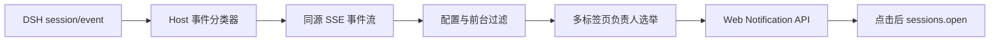

# dsh-notifications

[](README.md)
[](README_en.md)

<div align="center">

DeepSeek Harness（DSH）Web 消息通知插件：会话待审批、发起结构化提问、成功完成或失败时，通过浏览器通知提醒用户，点击通知即可打开对应会话。

[](LICENSE)
[](package.json)
[](https://github.com/deepseek-ai/deepseek-harness)

</div>

---

## 📑 目录

- [📸 界面预览](#-界面预览)
- [✨ 功能特性](#-功能特性)
- [🚀 快速开始](#-快速开始)
- [📖 使用说明](#-使用说明)
- [⚙️ 配置说明](#️-配置说明)
- [🔧 工作原理](#-工作原理)
- [🧪 开发与测试](#-开发与测试)
- [⚠️ 已知限制](#️-已知限制)
- [🤝 贡献](#-贡献)
- [📄 许可证](#-许可证)

---

## 📸 界面预览

插件配置列表（「设置 → 插件 → 插件配置」中的「消息通知」入口）：


展开后的「消息通知」配置面板（通知开关、浏览器权限与操作按钮）：


---

## ✨ 功能特性

| 功能 | 说明 |
|------|------|
| **全会话监听** | 监听全部 DSH 会话，不限于当前打开的会话 |
| **四类通知** | 待审批、等待回答、任务成功、任务失败 |
| **子代理通知独立开关** | 可单独开启或关闭子代理任务成功与失败通知 |
| **前台抑制** | 当前会话正在前台查看时自动抑制重复提醒 |
| **多标签页单发** | 多个 DSH 标签页同时打开时，只由一个标签页发送通知 |
| **点击直达** | 点击通知聚焦 DSH 并打开对应会话（会话已不存在时仅聚焦页面） |
| **独立配置模块** | 在「设置 → 插件 → 插件配置」提供独立配置模块 |
| **隐私安全** | 通知事件不包含聊天正文、问题内容、审批参数或工具参数 |
| **双语言界面** | 中英文界面，跟随 DSH 活动语言 |

---

## 🚀 快速开始

### 前提条件

- 已安装 DSH CLI 与 pnpm（`dsh plugin` 内部转发到 pnpm）
- 兼容 DeepSeek Harness `0.1.0-rc.6` / `0.1.0-rc.7` 系列；Windows / macOS / Linux；Chromium 内核浏览器（Chrome、Edge、Brave 等）
- DSH 页面必须保持打开；浏览器关闭后无法通知

### 安装

```sh
# 方式一：从 GitHub 安装
dsh plugin --profile web add github:Ycet/dsh-notifications

# 方式二：从本地源码安装（开发）
dsh plugin --profile web add dsh-notifications@file:<absolute-path-to-plugin>
```

包声明了 `dsh.bundle` 补丁层，`dsh plugin` 会自动把加载项合入 profile 的 bundle 层，无需手动编辑 `cordis.patch.yml`。

> [!NOTE]
> `file:` 安装是快照：更新源码后需重新执行安装命令，再重启 `dsh web` 生效（bundle 层变更不热加载）。

卸载：

```sh
dsh plugin --profile web remove dsh-notifications
```

### 启动

1. 重启网页应用：`dsh web`
2. 打开 http://127.0.0.1:3080，进入「设置 → 插件 → 插件配置」
3. 展开「消息通知」，点击「授权通知」并在浏览器权限提示中选择允许

---

## 📖 使用说明

1. 安装插件并重启 `dsh web`；
2. 打开「设置 → 插件 → 插件配置」；
3. 展开「消息通知」模块；
4. 点击「授权通知」，在浏览器权限提示中选择允许；
5. 点击「发送测试通知」验证浏览器设置；
6. 按需开关各类通知及子代理任务结束通知并保存。

默认只有在 DSH 标签页处于后台，或事件来自非当前会话时才通知。点击通知会聚焦 DSH 并打开对应会话；若目标会话已经不存在，则只聚焦页面。

> [!WARNING]
> 浏览器必须授予当前 DSH 地址通知权限。回环地址可使用 Web Notification API；非安全远程 HTTP 地址可能被浏览器拒绝。

---

## ⚙️ 配置说明

配置存储在 DSH settings 服务的 `dsh-notifications` namespace：

| 字段 | 默认值 | 说明 |
| --- | --- | --- |
| `enabled` | `true` | 总开关 |
| `approvalPendingEnabled` | `true` | 待审批通知 |
| `questionPendingEnabled` | `true` | 结构化提问通知 |
| `taskSucceededEnabled` | `true` | 任务成功通知 |
| `taskFailedEnabled` | `true` | 任务失败通知 |
| `subagentTaskEndedEnabled` | `true` | 子代理任务成功或失败通知；关闭后不影响顶层任务通知 |

浏览器权限不写入 DSH 配置，由浏览器按 DSH origin 独立保存。

---

## 🔧 工作原理



Host 订阅 DSH `session/event`，只将事件归一化为以下安全结构：

```json
{
  "eventId": "session-id:sequence:event-type",
  "type": "approval_pending",
  "sessionId": "session-id",
  "occurredAt": 1786953600000
}
```

同源接口：

| 方法 | 路径 | 用途 |
| --- | --- | --- |
| `GET` | `/dsh-notifications/api/config` | 读取配置与 revision |
| `POST` | `/dsh-notifications/api/config` | 保存或恢复默认配置 |
| `GET` | `/dsh-notifications/api/events` | SSE 通知事件流 |

SSE 仅在连接短暂中断时补发事件：Host 内存最多保存 256 条、5 分钟；首次连接和 Host 重启后不回放历史事件。

---

## 🧪 开发与测试

```bash
pnpm install
pnpm build
pnpm test
pnpm check
```

事件分类器采用显式结构契约：审批或提问必须是对应的 pending/request 事件，结构化提问也支持 `tool/call` 中的 `request_user_input` 等明确工具名；普通 assistant 文本不会按问号识别。`turn/end` 默认为成功，明确的失败结果映射为失败，取消和中止不通知。子代理通过 DSH 官方会话元数据 `origin: "subagent"` 或正数 `delegationDepth` 识别，不通过标题或 DOM 文本推断。

---

## ⚠️ 已知限制

- DSH 尚未公开完整事件 schema。插件会在 debug 日志中仅记录未知事件的类型和字段名，便于升级适配，不记录字段值。
- 如果目标 DSH 版本没有为某类状态提供官方事件，该类通知不会触发；插件不会通过 DOM 文案或 CSS 选择器猜测状态。
- Firefox 和 Safari 未列入首版验收范围。
- 不提供原生 Node 通知、浏览器关闭后的推送、自定义通知音或外部消息渠道。
- 多标签页采用 BroadcastChannel，并在不支持时用短期 localStorage 租约兜底；极端浏览器崩溃后最多等待约 6 秒重新选举。

---

## 🤝 贡献

欢迎提交 Issue 与 Pull Request：提交 Issue 时请提供 DSH 版本、浏览器与操作系统版本、触发的事件类型以及脱敏后的 debug 日志（不要提交聊天正文、审批参数或凭据），反馈地址 [Issues](https://github.com/Ycet/dsh-notifications/issues)；改进请按 Fork → 分支 → PR 流程提交，并说明新增事件契约及兼容版本。

---

## 📄 许可证

本项目使用 [MIT](LICENSE) 许可证。
