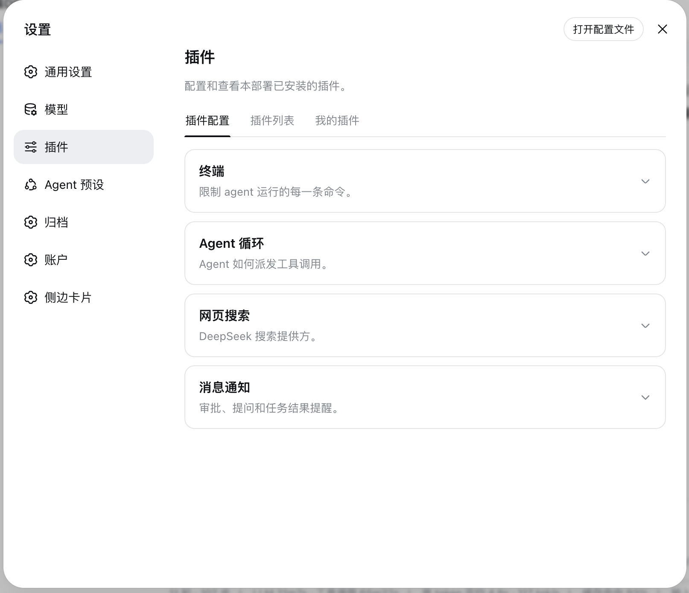
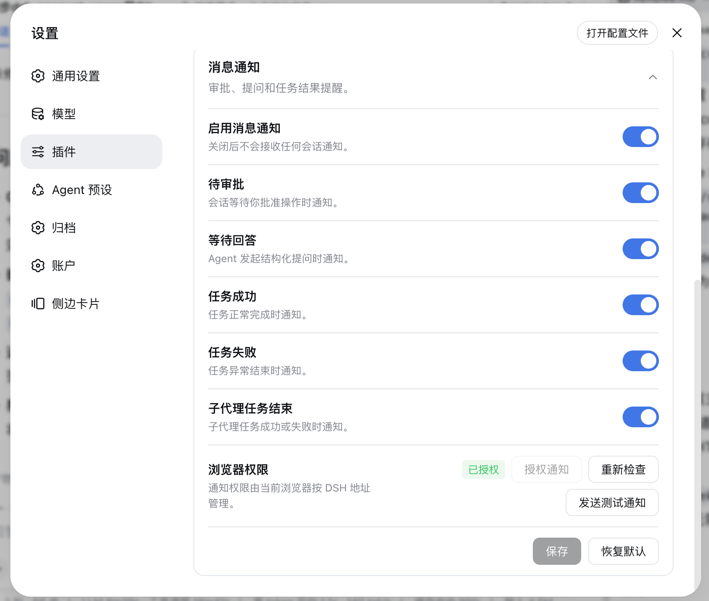
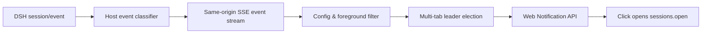

# dsh-notifications

[](README.md)
[](README_en.md)

<div align="center">

A DeepSeek Harness (DSH) web notification plugin: reminds users via browser notifications when a session is waiting for approval, asks a structured question, completes successfully, or fails — click the notification to open the corresponding session.

[](LICENSE)
[](package.json)
[](https://github.com/deepseek-ai/deepseek-harness)

</div>

---

## 📑 Table of Contents

- [📸 Preview](#-preview)
- [✨ Features](#-features)
- [🚀 Quick Start](#-quick-start)
- [📖 Usage](#-usage)
- [⚙️ Configuration](#️-configuration)
- [🔧 How It Works](#-how-it-works)
- [🧪 Development & Testing](#-development--testing)
- [⚠️ Known Limitations](#️-known-limitations)
- [🤝 Contributing](#-contributing)
- [📄 License](#-license)

---

## 📸 Preview

Plugin configuration list (the "Notifications" entry under Settings → Plugins → Plugin configuration):



The expanded "Notifications" configuration panel (notification toggles, browser permission and action buttons):



---

## ✨ Features

| Feature | Description |
|---------|-------------|
| **All-session watching** | Watches all DSH sessions, not only the currently open session |
| **Four notification types** | Approval pending, question pending, task succeeded, task failed |
| **Independent subagent toggles** | Enable or disable subagent task-success and task-failure notifications independently |
| **Foreground suppression** | Suppresses duplicate alerts while the current session is being viewed in the foreground |
| **Single-tab delivery** | With multiple DSH tabs open, only one tab sends notifications |
| **Click to open** | Clicking a notification focuses DSH and opens the corresponding session (focuses the page only if the session no longer exists) |
| **Dedicated config module** | A dedicated configuration module under "Settings → Plugins → Plugin configuration" |
| **Privacy-safe** | Notification events contain no chat content, question content, approval parameters or tool parameters |
| **Bilingual UI** | Chinese and English UI, following DSH's active language |

---

## 🚀 Quick Start

### Prerequisites

- DSH CLI and pnpm installed (`dsh plugin` forwards to pnpm internally)
- Compatible with DeepSeek Harness `0.1.0-rc.6` / `0.1.0-rc.7` series; Windows / macOS / Linux; Chromium-based browsers (Chrome, Edge, Brave, etc.)
- The DSH page must stay open; notifications cannot be delivered after the browser closes

### Install

```sh
# Option 1: install from GitHub
dsh plugin --profile web add github:Ycet/dsh-notifications

# Option 2: install from a local source directory (development)
dsh plugin --profile web add dsh-notifications@file:<absolute-path-to-plugin>
```

The package declares a `dsh.bundle` patch layer; `dsh plugin` merges the loader entry into the profile's bundle layer automatically — no manual editing of `cordis.patch.yml` required.

> [!NOTE]
> `file:` installation uses a snapshot: re-run the install command after updating the source, then restart `dsh web` for it to take effect (bundle-layer changes are not hot-reloaded).

Uninstall:

```sh
dsh plugin --profile web remove dsh-notifications
```

### Launch

1. Restart the web app: `dsh web`
2. Open http://127.0.0.1:3080 and go to "Settings → Plugins → Plugin configuration"
3. Expand "Notifications", click "Grant notification access" and choose Allow in the browser permission prompt

---

## 📖 Usage

1. Install the plugin and restart `dsh web`;
2. Open "Settings → Plugins → Plugin configuration";
3. Expand the "Notifications" module;
4. Click "Grant notification access" and choose Allow in the browser permission prompt;
5. Click "Send test notification" to verify the browser setup;
6. Toggle the notification types and the subagent task-ended notifications as needed, then save.

By default, notifications fire only when the DSH tab is in the background or the event comes from a session other than the current one. Clicking a notification focuses DSH and opens the corresponding session; if the target session no longer exists, it only focuses the page.

> [!WARNING]
> The current DSH origin must be granted browser notification permission. Loopback addresses may use the Web Notification API; browsers may reject non-secure remote HTTP addresses.

---

## ⚙️ Configuration

Settings are stored in the `dsh-notifications` namespace of the DSH settings service:

| Field | Default | Description |
| --- | --- | --- |
| `enabled` | `true` | Master switch |
| `approvalPendingEnabled` | `true` | Approval-pending notifications |
| `questionPendingEnabled` | `true` | Structured-question notifications |
| `taskSucceededEnabled` | `true` | Task-succeeded notifications |
| `taskFailedEnabled` | `true` | Task-failed notifications |
| `subagentTaskEndedEnabled` | `true` | Subagent task success/failure notifications; turning this off does not affect top-level task notifications |

Browser permission is not stored in DSH configuration; the browser keeps it independently per DSH origin.

---

## 🔧 How It Works



The host subscribes to DSH `session/event` and normalizes every event into this safe structure:

```json
{
  "eventId": "session-id:sequence:event-type",
  "type": "approval_pending",
  "sessionId": "session-id",
  "occurredAt": 1786953600000
}
```

Same-origin endpoints:

| Method | Path | Purpose |
| --- | --- | --- |
| `GET` | `/dsh-notifications/api/config` | Read configuration and revision |
| `POST` | `/dsh-notifications/api/config` | Save or restore default configuration |
| `GET` | `/dsh-notifications/api/events` | SSE notification event stream |

SSE re-delivers events only after a brief connection drop: the host keeps at most 256 events in memory for 5 minutes; no history is replayed on first connection or after a host restart.

---

## 🧪 Development & Testing

```bash
pnpm install
pnpm build
pnpm test
pnpm check
```

The event classifier uses an explicit structural contract: approvals or questions must be the corresponding pending/request events; structured questions also accept explicit tool names such as `request_user_input` inside `tool/call`; plain assistant text is never treated as a question based on question marks. `turn/end` defaults to success, explicit failure results map to failure, and cancellation/abort are not notified. Subagents are identified through official DSH session metadata (`origin: "subagent"` or a positive `delegationDepth`), never inferred from titles or DOM text.

---

## ⚠️ Known Limitations

- DSH does not yet expose a complete event schema. The plugin logs only the type and field names of unknown events in debug logs (never field values) for easier upgrade adaptation.
- If the target DSH version provides no official event for a certain state class, that notification will not fire; the plugin never guesses state from DOM text or CSS selectors.
- Firefox and Safari are out of scope for the initial acceptance.
- No native Node notifications, push after browser close, custom notification sounds, or external messaging channels.
- Multi-tab delivery uses BroadcastChannel, with a short-lived localStorage lease as fallback; after an extreme browser crash, re-election takes at most about 6 seconds.

---

## 🤝 Contributing

Issues and pull requests are welcome: when filing an issue, provide the DSH version, browser and OS versions, the triggered event type, and sanitized debug logs (never chat content, approval parameters or credentials) at [Issues](https://github.com/Ycet/dsh-notifications/issues); for improvements, follow Fork → branch → PR and describe new event contracts and the compatible versions.

---

## 📄 License

This project is licensed under the [MIT](LICENSE) license.
